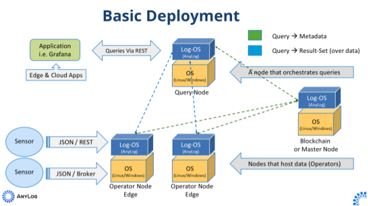

# EdgeLake: Empowering Data Management with AnyLog Open-Source

EdgeLage (by AnyLog) is a decentralized network to manage IoT data. Nodes in the network are compute instances that execute the AnyLog 
Software. Joining a network requires the following steps:
1. Install the EdgeLake Software on computer instance
2. Configure a node such that it can join an exiting network (or create a new network).

* [Documentation](https://github.com/AnyLog-co/documentation)

# General Configuration of Network

A basic network setup consists of a _master_, 2 _operator_  and _query_ node - as shown in the image below. These nodes 
can be deployed either on the same physical machine, or unique machines. Directions for [Quick Deployment](https://github.com/AnyLog-co/documentation/blob/master/deployments/Quick%20Deployment.md)
of the diagram. 

 