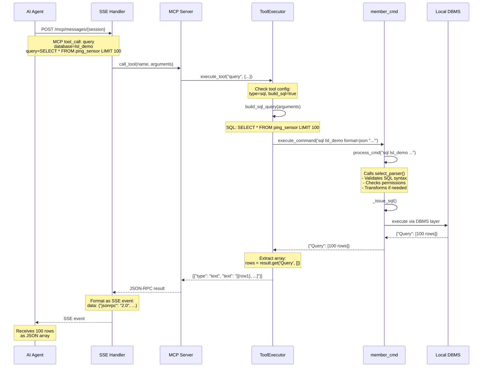
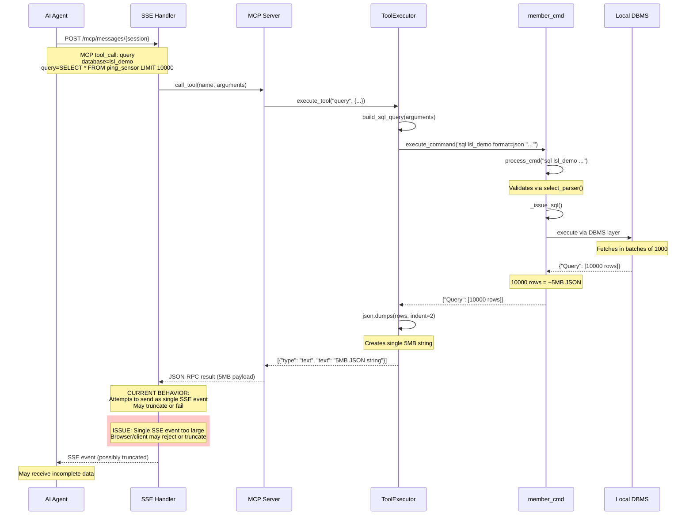
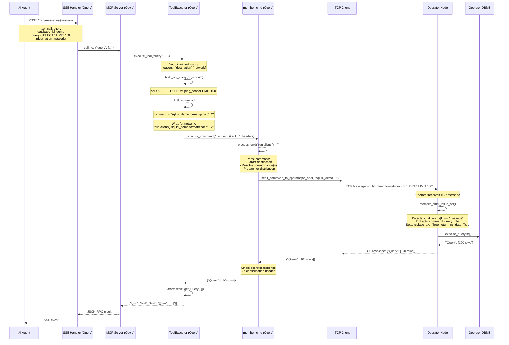
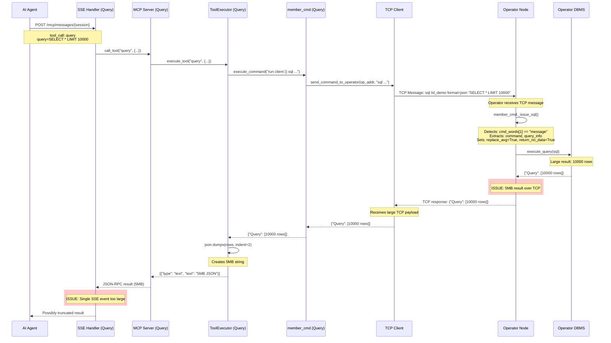
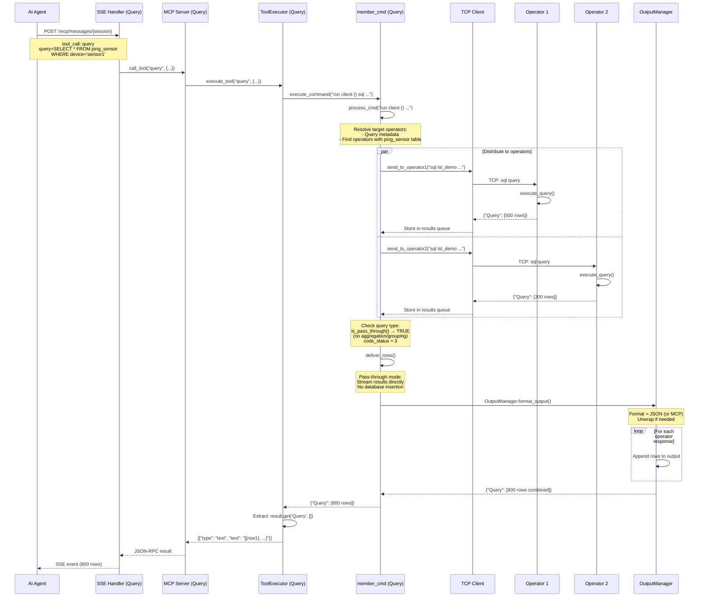
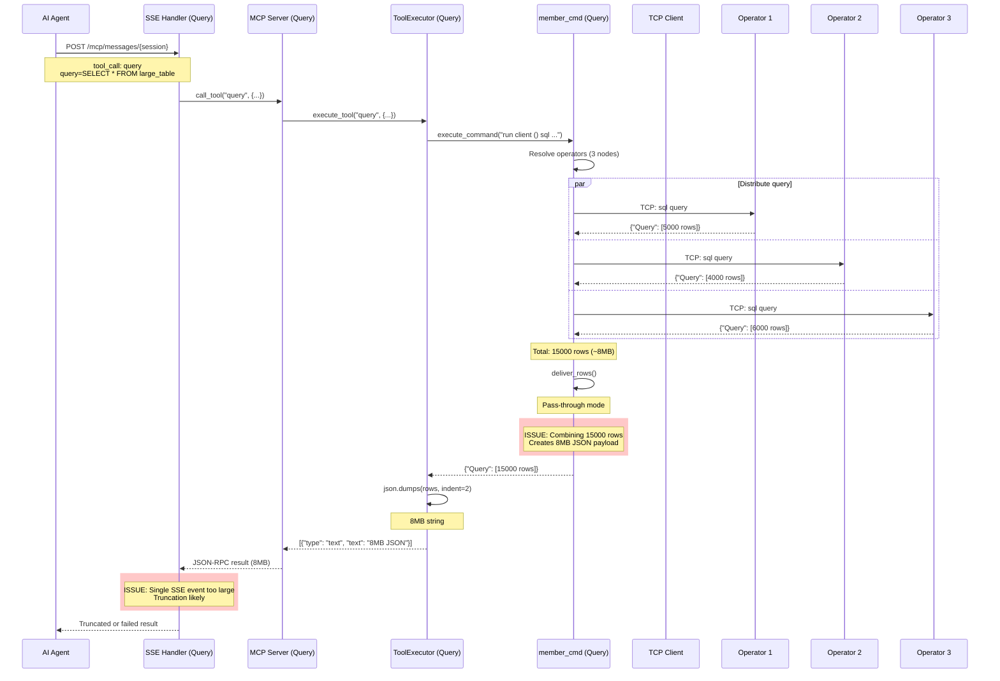
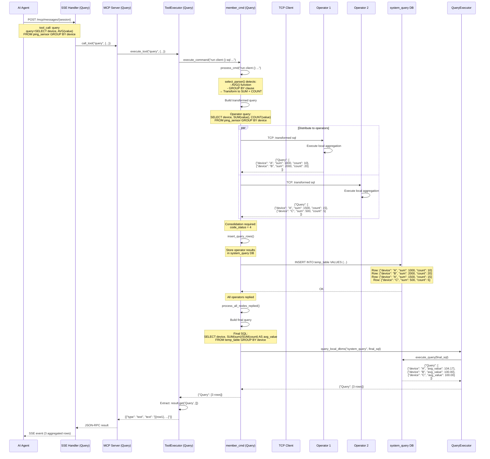
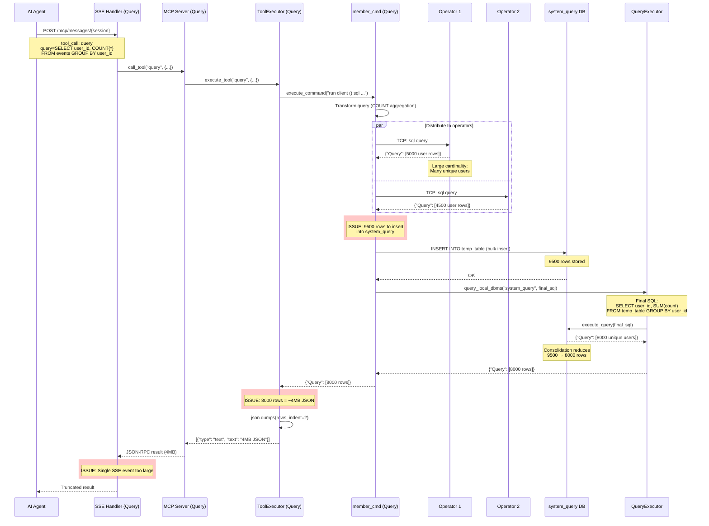

# Query Processing Sequence Diagrams

This document provides detailed sequence diagrams for all MCP query processing flows in EdgeLake.

**Purpose**: Visualize complete request/response flows including:
- Query routing and execution paths
- Format transformations at each layer
- Blocking vs streaming behavior
- Network distribution and consolidation

**License**: Mozilla Public License 2.0

---

## Table of Contents

0. [**Network Flow with Aggregation (Complete)**](#network-flow-with-aggregation-complete) ⭐ **START HERE**
1. [Flow 1: MCP on Operator → Local Database](#flow-1-mcp-on-operator--local-database)
   - [1a: Small Result (No Blocking)](#flow-1a-small-result-no-blocking)
   - [1b: Large Result (Streaming)](#flow-1b-large-result-streaming)
2. [Flow 2: MCP on Query Node → Specific Operator](#flow-2-mcp-on-query-node--specific-operator)
   - [2a: Small Result (No Blocking)](#flow-2a-small-result-no-blocking)
   - [2b: Large Result (Blocking)](#flow-2b-large-result-blocking)
3. [Flow 3: MCP on Query Node → Network (Pass-through)](#flow-3-mcp-on-query-node--network-pass-through)
   - [3a: Small Result (No Blocking)](#flow-3a-small-result-no-blocking)
   - [3b: Large Result (Blocking)](#flow-3b-large-result-blocking)
4. [Flow 4: MCP on Query Node → Network (Consolidation)](#flow-4-mcp-on-query-node--network-consolidation)
   - [4a: Small Result (No Blocking)](#flow-4a-small-result-no-blocking)
   - [4b: Large Result (Blocking)](#flow-4b-large-result-blocking)

---

## Network Flow with Aggregation (Complete)

**⭐ This is the definitive end-to-end flow showing ALL components, threads, and data transformations.**

**Scenario**: MCP client (Claude Desktop) queries Query Node → distributes to 2 Operators → aggregation with GROUP BY

**Key Features Shown**:
- Threading model (HTTP workers, MCP workers, TCP threads)
- Format transformations (format=mcp → json:list)
- Query transformation (AVG → SUM+COUNT)
- Consolidation in system_query database
- Socket streaming with BytesIO buffer
- Complete call stack from client to database

```mermaid
sequenceDiagram
    participant Client as MCP Client<br/>(Claude Desktop)
    participant HTTP as HTTP Server<br/>(port 32049)<br/>⚡ Thread Pool
    participant SSE as SSE Handler<br/>⚡ Worker Thread
    participant MCP as MCP Server<br/>⚡ Same Thread
    participant Exec as Tool Executor<br/>⚡ Same Thread
    participant DirClient as Direct Client<br/>⚡ Same Thread
    participant CMD as member_cmd<br/>⚡ Same Thread
    participant Parser as select_parser<br/>⚡ Same Thread
    participant TCP as TCP Client<br/>⚡ New Thread per Op
    participant OP1 as Operator 1<br/>⚡ TCP Handler
    participant OP2 as Operator 2<br/>⚡ TCP Handler
    participant SYSDB as system_query DB<br/>(Query Node)
    participant Socket as BytesIO Buffer<br/>(Captures Output)

    Client->>HTTP: POST /mcp/messages/{session_id}
    Note over Client,HTTP: JSON-RPC: tools/call<br/>name: "query"<br/>database: "new_company"<br/>table: "rand_data"<br/>select: ["avg(value)", "count(*)"]

    HTTP->>SSE: Route to SSE handler
    Note over HTTP: HTTP worker picks up request<br/>from thread pool

    SSE->>SSE: Create BytesIO buffer
    Note over SSE: socket_buffer = BytesIO()<br/>Will capture streaming output

    SSE->>MCP: process_message(message, socket_buffer)
    Note over SSE: Pass buffer for output capture

    MCP->>MCP: Parse JSON-RPC
    Note over MCP: Extract: method="tools/call"<br/>params={name, arguments}

    MCP->>Exec: execute_tool("query", arguments)

    Exec->>Exec: build_sql_query(arguments)
    Note over Exec: SQL = "SELECT avg(value), count(*)<br/>FROM rand_data"<br/>format = "mcp"

    Exec->>Exec: build_command()
    Note over Exec: Add destination header:<br/>headers = {'destination': 'network'}

    Exec->>Exec: Format command
    Note over Exec: "run client () sql new_company<br/>format=mcp \"SELECT avg(value)...\""

    Exec->>DirClient: execute_command(cmd, headers, socket_buffer)

    DirClient->>DirClient: Create ProcessStat + io_buff
    Note over DirClient: status = ProcessStat()<br/>io_buff = bytearray(32768)

    DirClient->>DirClient: Set REST caller flag
    Note over DirClient: j_handle.set_rest_caller()<br/>(Ensures JSON format, not Python dict)

    DirClient->>DirClient: Set output socket
    Note over DirClient: j_handle.set_output_socket(socket_buffer)<br/>Query results will stream to buffer

    DirClient->>CMD: process_cmd(status, command, io_buff)

    CMD->>CMD: Parse command words
    Note over CMD: cmd_words = ["run", "client", "()", "sql",<br/>"new_company", "format", "=", "mcp", "SELECT..."]

    CMD->>CMD: get_sql_processing_info()
    Note over CMD: Extract: dbms="new_company"<br/>conditions={'format': ['mcp']}<br/>sql="SELECT avg(value)..."

    rect rgb(200, 220, 255)
        Note over CMD: FORMAT CONVERSION:<br/>Detect format=['mcp']<br/>Convert to ['json:list']<br/>conditions['format'] = ['json:list']
    end

    CMD->>Parser: select_parser(sql)
    Note over Parser: Parse SQL:<br/>- Detect AVG() function<br/>- Detect aggregation<br/>- Transform for distribution

    rect rgb(255, 220, 200)
        Note over Parser: QUERY TRANSFORMATION:<br/>AVG(value) → SUM(value), COUNT(value)<br/>For distributed aggregation
    end

    Parser-->>CMD: Transformed SQL
    Note over CMD: Operator query:<br/>"SELECT SUM(value), COUNT(value)<br/>FROM rand_data"

    CMD->>CMD: Resolve target operators
    Note over CMD: Query metadata/blockchain:<br/>Find operators with rand_data table<br/>→ [Operator1, Operator2]

    par Distribute to Operator 1
        CMD->>TCP: send_to_operator1()
        Note over TCP: ⚡ New thread spawned<br/>for async TCP send

        TCP->>OP1: TCP Message
        Note over TCP,OP1: Header: command length, data length<br/>Command: "sql new_company format=json:list<br/>        SELECT SUM(value), COUNT(value)..."<br/>Data: query_info (metadata)

        OP1->>OP1: Receive TCP message
        Note over OP1: ⚡ TCP handler thread<br/>Detects: cmd_words[1] == "message"<br/>Sets: replace_avg=True

        OP1->>OP1: member_cmd.process_cmd()
        Note over OP1: Execute transformed query locally

        OP1->>OP1: Local DBMS query
        Note over OP1: SELECT SUM(value), COUNT(value)<br/>FROM rand_data

        OP1-->>TCP: {"Query": [{"sum": 1000, "count": 10}]}
        Note over OP1: Format = json:list<br/>Returns {"Query": [...]} wrapper

        TCP-->>CMD: Store result in queue
    and Distribute to Operator 2
        CMD->>TCP: send_to_operator2()
        Note over TCP: ⚡ New thread spawned

        TCP->>OP2: TCP Message
        Note over TCP,OP2: Same format as Operator 1

        OP2->>OP2: Receive TCP message
        Note over OP2: ⚡ TCP handler thread

        OP2->>OP2: member_cmd.process_cmd()

        OP2->>OP2: Local DBMS query
        Note over OP2: SELECT SUM(value), COUNT(value)<br/>FROM rand_data

        OP2-->>TCP: {"Query": [{"sum": 1500, "count": 15}]}

        TCP-->>CMD: Store result in queue
    end

    CMD->>CMD: Wait for all operators
    Note over CMD: Poll results queue<br/>Until all operators replied<br/>or timeout

    CMD->>CMD: Check query type
    Note over CMD: is_consolidation_required() → TRUE<br/>code_status = 4<br/>(Requires aggregation)

    rect rgb(220, 255, 220)
        Note over CMD: CONSOLIDATION PHASE:<br/>Store operator results in system_query
    end

    CMD->>CMD: insert_query_rows()
    Note over CMD: map_results_to_insert()<br/>Parse {"Query": [...]} format

    CMD->>SYSDB: INSERT INTO temp_table
    Note over SYSDB: Row 1: {sum: 1000, count: 10}<br/>Row 2: {sum: 1500, count: 15}

    SYSDB-->>CMD: OK (2 rows inserted)

    CMD->>CMD: Build final aggregation query
    Note over CMD: "SELECT SUM(sum)/SUM(count) AS avg_value,<br/>       SUM(count) AS total_count<br/>FROM temp_table"

    CMD->>CMD: query_local_dbms("system_query", final_sql)

    CMD->>SYSDB: Execute final query

    SYSDB-->>CMD: {"Query": [{"avg_value": 104.17, "total_count": 25}]}

    rect rgb(255, 255, 200)
        Note over CMD: SOCKET STREAMING:<br/>Results written to socket_buffer<br/>via OutputManager
    end

    CMD->>Socket: Write result to BytesIO
    Note over Socket: OutputManager formats output<br/>Writes to socket_buffer

    CMD-->>DirClient: Return ""
    Note over CMD: Query results already in socket,<br/>return empty string

    DirClient->>DirClient: Check result_set
    Note over DirClient: result_set is empty<br/>(Results streamed to socket)

    DirClient-->>Exec: Return ""

    Exec->>Exec: Extract socket data
    Note over Exec: socket_text = socket_buffer.getvalue()<br/>Read streamed output

    Exec->>Exec: Parse response
    Note over Exec: result = json.loads(socket_text)<br/>Extract array from {"Query": [...]}

    Exec-->>MCP: [{"type": "text", "text": "[{result}]"}]

    MCP->>MCP: Format JSON-RPC response
    Note over MCP: {"jsonrpc": "2.0",<br/> "result": {"content": [...]}}

    MCP-->>SSE: Return response

    SSE->>SSE: Format as SSE event
    Note over SSE: "data: {json_rpc_response}\n\n"

    SSE-->>HTTP: Write to HTTP response stream

    HTTP-->>Client: SSE event
    Note over Client: Receives aggregated result:<br/>[{"avg_value": 104.17, "total_count": 25}]
```



### Key Observations

**Threading Model**:
1. **HTTP Worker Thread**: Handles initial POST request from thread pool
2. **SSE Handler**: Runs on same HTTP worker thread (no new thread)
3. **MCP Server**: Synchronous processing on same thread
4. **Direct Client**: Synchronous call to member_cmd on same thread
5. **TCP Clients**: NEW threads spawned for each operator (async distribution)
6. **Operator TCP Handlers**: Separate threads on operator nodes

**Format Transformations**:
1. **Client → Query Node**: format=mcp specified in tool arguments
2. **Query Node Processing**: mcp → json:list conversion (line 3670 in member_cmd.py)
3. **Query → Operators**: format=json:list sent via TCP
4. **Operators → Query**: {"Query": [...]} wrapper required for consolidation
5. **Query → Client**: Unwrapped to plain array `[...]`

**Query Transformations**:
1. **Original**: `SELECT avg(value), count(*) FROM rand_data`
2. **Transformed for Operators**: `SELECT SUM(value), COUNT(value) FROM rand_data`
3. **Final Consolidation**: `SELECT SUM(sum)/SUM(count), SUM(count) FROM temp_table`

**Critical Components**:
- **BytesIO Buffer**: Captures streaming output without STDOUT pollution
- **system_query DB**: Temporary storage for consolidation
- **OutputManager**: Handles format unwrapping ({"Query": [...]} → [...])
- **member_cmd.process_cmd()**: Unified path for all query types

**Why This Works**:
1. Socket streaming avoids STDOUT capture (no debug pollution)
2. format=mcp → json:list conversion ensures operator compatibility
3. {"Query": [...]} wrapper required by map_results_to_insert()
4. Consolidation via system_query enables distributed aggregation
5. BytesIO buffer captures results without corrupting HTTP response

---

## Flow 1: MCP on Operator → Local Database

**Scenario**: AI agent connects to Operator Node's MCP server and queries local database.

**Key Characteristics**:
- Single node execution
- Uses member_cmd.process_cmd() (same path as all queries)
- No network distribution
- Direct local database access via _issue_sql()

### Flow 1a: Small Result (No Blocking)

**Trigger**: Query returns ≤1000 rows (fits in single SSE event)



**Key Points**:
- **Unified Path**: Uses same member_cmd path as network queries (Flows 2-4)
- **Format**: Query returns `{"Query": [...]}`, MCP unwraps to `[...]`
- **Single SSE Event**: Entire result fits in one event (~10-100KB)
- **No Chunking**: Direct transmission
- **Execution Time**: ~50-200ms

---

### Flow 1b: Large Result (Streaming)

**Trigger**: Query returns >1000 rows (requires multiple batches)



**Current Issues**:
- **Memory**: Entire result loaded into memory
- **SSE Event Size**: Single event can exceed practical limits (>1MB)
- **Truncation Risk**: Large events may be rejected by client

**Solution (Phase 2A)**:
- Chunk result into multiple SSE events (e.g., 100 rows per event)
- Stream progressively to client
- Add completion marker

---

## Flow 2: MCP on Query Node → Specific Operator

**Scenario**: AI agent connects to Query Node's MCP server and targets a specific Operator Node.

**Key Characteristics**:
- Network query (`destination=network`)
- Single operator targeted
- Uses `run client ()` wrapper
- Results return through Query Node

### Flow 2a: Small Result (No Blocking)

**Trigger**: Query returns ≤1000 rows from operator



**Key Points**:
- **Network Distribution**: Query Node forwards to single operator
- **Format**: Operator returns `{"Query": [...]}` (required for compatibility)
- **No Consolidation**: Single source, direct pass-through
- **Single SSE Event**: Result fits in one event

---

### Flow 2b: Large Result (Blocking)

**Trigger**: Query returns >1000 rows from operator (requires chunking/blocking)



**Current Issues**:
- **TCP Payload**: Large result transmitted as single TCP message
- **SSE Event**: Same truncation risk as Flow 1b

**Solution (Phase 2B - Block Transport)**:
- Operator stores result in temporary block
- Returns block_id instead of full data
- Query Node fetches block via message_server
- Streams to client in chunks

---

## Flow 3: MCP on Query Node → Network (Pass-through)

**Scenario**: AI agent queries multiple operators, no aggregation needed (e.g., `SELECT *` with no `GROUP BY`/`AVG`/etc.)

**Key Characteristics**:
- Multiple operators respond
- No consolidation (code_status=3)
- Results streamed via deliver_rows()
- OutputManager handles format unwrapping

### Flow 3a: Small Result (No Blocking)

**Trigger**: Each operator returns ≤1000 rows, total result fits in memory



**Key Points**:
- **Pass-through Mode**: code_status=3, no database storage
- **Parallel Execution**: Query distributed to multiple operators simultaneously
- **Format Preservation**: Operators return `{"Query": [...]}`, Query Node unwraps
- **Single Result**: Combined results fit in one SSE event

---

### Flow 3b: Large Result (Blocking)

**Trigger**: Multiple operators return large datasets (total >1000 rows)



**Current Issues**:
- **Memory Pressure**: 15000 rows loaded into memory
- **TCP Bottleneck**: Multiple large TCP responses
- **SSE Limit**: Single event exceeds practical size

**Solution (Phase 2)**:
- **Phase 2A (Immediate)**: Chunk combined result into multiple SSE events
- **Phase 2B (Future)**: Operators use block transport, Query Node streams blocks

---

## Flow 4: MCP on Query Node → Network (Consolidation)

**Scenario**: AI agent queries multiple operators with aggregation (e.g., `AVG()`, `GROUP BY`)

**Key Characteristics**:
- Multiple operators respond
- Requires consolidation (code_status=4)
- Results stored in "system_query" database
- Local query executes aggregation
- Operator format MUST be `{"Query": [...]}`

### Flow 4a: Small Result (No Blocking)

**Trigger**: Aggregation produces small result (≤1000 rows)



**Key Points**:
- **Query Transformation**: AVG → SUM + COUNT for distributed execution
- **Operator Format**: MUST return `{"Query": [...]}` for map_results_to_insert()
- **Consolidation Database**: Temporary storage in system_query
- **Final Aggregation**: Local query computes final AVG from SUM/COUNT
- **Small Result**: Aggregation typically produces few rows

---

### Flow 4b: Large Result (Blocking)

**Trigger**: Aggregation with high cardinality (e.g., GROUP BY timestamp, user_id)



**Current Issues**:
- **High Cardinality**: GROUP BY on high-cardinality fields produces many rows
- **Database Insertion**: 9500 rows inserted into system_query
- **Final Result**: Consolidation reduces but still large (8000 rows)
- **SSE Truncation**: Same issue as other large result flows

**Solution (Phase 2A)**:
- Chunk final result into multiple SSE events
- Stream consolidated result progressively

---

## Summary Table

| Flow | Scenario | Execution Path | Format | Blocking Needed? |
|------|----------|---------------|--------|------------------|
| **1a** | Operator local, small | member_cmd → _issue_sql → Local DB | `{"Query": [...]}` → `[...]` | No (single SSE) |
| **1b** | Operator local, large | member_cmd → _issue_sql → Local DB | `{"Query": [...]}` → `[...]` | Yes (chunked SSE) |
| **2a** | Query → Single op, small | member_cmd → run client → TCP → Operator | `{"Query": [...]}` → `[...]` | No (single SSE) |
| **2b** | Query → Single op, large | member_cmd → run client → TCP → Operator | `{"Query": [...]}` → `[...]` | Yes (block transport) |
| **3a** | Network pass-through, small | member_cmd → run client → TCP → Multi-op → deliver_rows | `{"Query": [...]}` → `[...]` | No (single SSE) |
| **3b** | Network pass-through, large | member_cmd → run client → TCP → Multi-op → deliver_rows | `{"Query": [...]}` → `[...]` | Yes (chunked SSE) |
| **4a** | Network consolidation, small | member_cmd → run client → TCP → system_query → local query | `{"Query": [...]}` required | No (single SSE) |
| **4b** | Network consolidation, large | member_cmd → run client → TCP → system_query → local query | `{"Query": [...]}` required | Yes (chunked SSE) |

**Note**: All flows now use the same unified member_cmd.process_cmd() execution path for consistency.

---

## TCP Message Processing on Operators

**Critical Implementation Detail**: When operators receive queries from the Query Node via TCP, the command format is `sql message`.

### Detection (member_cmd.py:5073)

```python
if (len(cmd_words) == 2 and cmd_words[1] == "message"):  # a tcp sql message
    message = True
    return_no_data = True       # If the table was not created, return no data from this server
    command = message_header.get_command(io_buff_in)
    query_info = message_header.get_data_decoded(io_buff_in)  # Additional info from caller node
    replace_avg = True  # Replace avg by count and sum for distributed aggregation
```

### Key Behaviors

1. **`message = True`**: Indicates TCP-originated query (not local CLI/REST/MCP)
2. **`return_no_data = True`**: If table doesn't exist on this operator, return empty result instead of error
3. **`replace_avg = True`**: Automatic AVG → SUM+COUNT transformation for distributed aggregation
4. **`query_info`**: Metadata from Query Node (partitioning instructions, query transformations)

### Why This Matters

- **Flows 2, 3, 4**: ALL operators process queries via `sql message` path when Query Node distributes work
- **Format Requirement**: `{"Query": [...]}` format required for consolidation compatibility
- **Transformation Support**: Distributed aggregations (AVG, etc.) automatically transformed
- **Fault Tolerance**: Missing tables don't break distributed queries

### Message Structure (message_header.py)

```
┌─────────────────┬──────────────────┬───────────────┐
│  Header         │  Command         │  Data         │
│  (metadata)     │  (SQL statement) │  (query_info) │
└─────────────────┴──────────────────┴───────────────┘
```

- **Header**: Fixed-size (message type, command length, data length, authentication)
- **Command**: SQL query as string (extracted via `get_command()`)
- **Data**: JSON query metadata (extracted via `get_data_decoded()`)

---

## Format Requirements by Flow

### Operator Node Responses

**ALL operator responses MUST use** `{"Query": [...]}` **format**:

1. **Compatibility**: Query Node consolidation requires object-wrapped format
2. **Consistency**: Same format for pass-through and consolidation modes
3. **Code Dependency**: `map_results_to_insert_main()` expects dict with single key

**Code Reference**: `edge_lake/json_to_sql/map_results_to_insert.py:62-64`
```python
for key in json_object:  # only one key in the dictionary
    columns = list(json_object[key][0].keys())
    return create_insert(status, table_name, json_object[key], columns)
```

### MCP Server Output

**MCP server unwraps to plain array** `[...]`:

1. **Client Simplicity**: AI agents expect clean JSON arrays
2. **Alignment**: Matches pass-through mode's OutputManager behavior
3. **Efficiency**: Direct dict access replaces JSONPath

**Code Reference**: `edge_lake/mcp_server/tools/executor.py:187-195`
```python
# Extract array directly - no JSONPath needed
rows = result.get('Query', [])
return json.dumps(rows, indent=2)
```

---

## Phase 2 Solutions

### Phase 2A: Chunked SSE Events (Immediate)

**Applies to**: Flows 1b, 3b, 4b (large results, same node)

**Implementation**:
1. Detect large results in executor.py (e.g., >1000 rows)
2. Split into chunks (100-500 rows each)
3. Send multiple SSE events with sequence markers
4. Add completion event

**Benefits**:
- Solves truncation immediately
- No architectural changes
- Works with current infrastructure

### Phase 2B: Block Transport (Future)

**Applies to**: Flow 2b (large results across network)

**Implementation**:
1. Operator stores large result in temporary block
2. Returns block_id instead of full data
3. Query Node fetches block via message_server
4. Streams to MCP client in chunks

**Benefits**:
- Reduces TCP payload size
- Enables true streaming across network
- Leverages existing message_server infrastructure

---

## Testing Recommendations

### Flow 1a/1b Testing
```bash
# Small result (1a)
curl -X POST http://localhost:32049/mcp/messages/test \
  -d '{"method": "tools/call", "params": {"name": "query", "arguments": {"database": "lsl_demo", "query": "SELECT * FROM ping_sensor LIMIT 100"}}}'

# Large result (1b)
curl -X POST http://localhost:32049/mcp/messages/test \
  -d '{"method": "tools/call", "params": {"name": "query", "arguments": {"database": "lsl_demo", "query": "SELECT * FROM ping_sensor LIMIT 10000"}}}'
```

### Flow 2a/2b Testing
```bash
# Small network query (2a)
curl -X POST http://localhost:32049/mcp/messages/test \
  -d '{"method": "tools/call", "params": {"name": "query_network", "arguments": {"database": "lsl_demo", "query": "SELECT * FROM ping_sensor LIMIT 100"}}}'

# Large network query (2b)
curl -X POST http://localhost:32049/mcp/messages/test \
  -d '{"method": "tools/call", "params": {"name": "query_network", "arguments": {"database": "lsl_demo", "query": "SELECT * FROM ping_sensor LIMIT 10000"}}}'
```

### Flow 3a/3b Testing
```bash
# Pass-through, small (3a)
curl -X POST http://localhost:32049/mcp/messages/test \
  -d '{"method": "tools/call", "params": {"name": "query_network", "arguments": {"database": "lsl_demo", "query": "SELECT * FROM ping_sensor WHERE device='\''sensor1'\''"}}}'

# Pass-through, large (3b)
curl -X POST http://localhost:32049/mcp/messages/test \
  -d '{"method": "tools/call", "params": {"name": "query_network", "arguments": {"database": "lsl_demo", "query": "SELECT * FROM large_table"}}}'
```

### Flow 4a/4b Testing
```bash
# Consolidation, small (4a)
curl -X POST http://localhost:32049/mcp/messages/test \
  -d '{"method": "tools/call", "params": {"name": "query_network", "arguments": {"database": "lsl_demo", "query": "SELECT device, AVG(value) FROM ping_sensor GROUP BY device"}}}'

# Consolidation, large (4b)
curl -X POST http://localhost:32049/mcp/messages/test \
  -d '{"method": "tools/call", "params": {"name": "query_network", "arguments": {"database": "lsl_demo", "query": "SELECT user_id, COUNT(*) FROM events GROUP BY user_id"}}}'
```

---

## Related Documentation

- **QUERY_MCP_BLOCK_STRATEGY.md**: Detailed block transport architecture
- **IMPLEMENTATION_PLAN.md**: Phase 2 implementation roadmap
- **DESIGN.md**: Overall MCP server architecture
- **README.md**: Quick start and usage guide

---

**Document Version**: 1.1
**Last Updated**: 2025-11-03
**Status**: Updated - QueryExecutor removed, unified member_cmd path for all flows
**Changelog**:
- v1.1 (2025-11-03): Removed QueryExecutor, all flows now use member_cmd.process_cmd()
- v1.0 (2025-11-02): Initial draft
